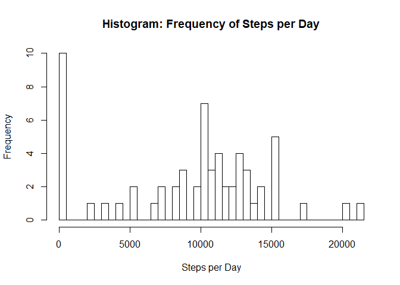
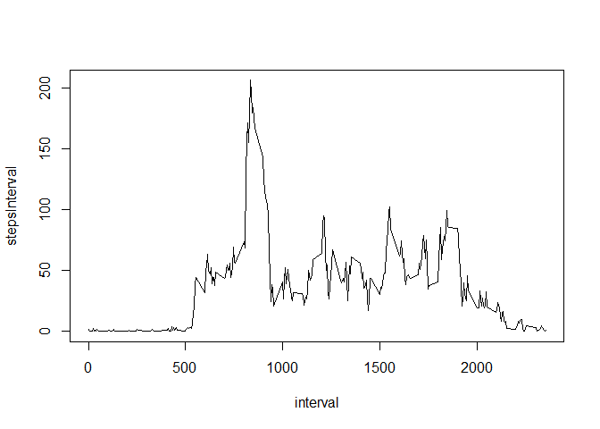
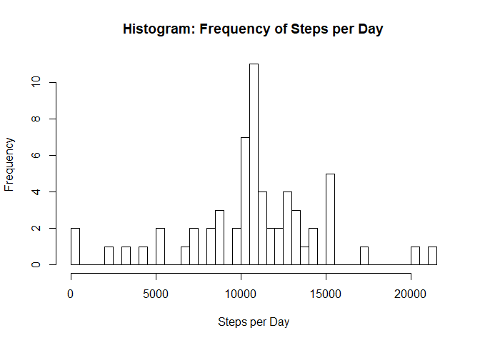
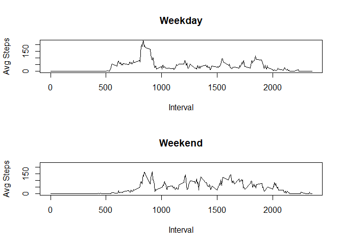

## Read and Process Data

```r
rawdata <- read.csv("activity.csv")
```

## Histogram of the total number of steps taken each day
First make sure dplyr is loaded. Then group the data by individual day (date).
Then take the sum of each day, while removing NA's. Then you use that to create a histogram.


```r
library(dplyr)
stepsPerDay <- group_by(rawdata, date) %>% 
               summarise("stepsDay" = sum(steps, na.rm = TRUE))
hist(stepsPerDay$stepsDay, 
        breaks = 50, 
        xlab = "Steps per Day", 
        main = "Histogram: Frequency of Steps per Day")
```

<!-- -->


## Mean and median number of steps taken each day
Uses the dataframe created above (stepsPerDay), to summarize all days and find Mean and Median. Before we impute the NA's to emaningful numbers the Mean = 9354 and Median = 10395.

```r
summarise(stepsPerDay, "Mean Steps per Day" = mean(stepsDay), 
        "Median Steps per Day" = median(stepsDay))
```

```
## # A tibble: 1 x 2
##   `Mean Steps per Day` `Median Steps per Day`
##                  <dbl>                  <int>
## 1                9354.                  10395
```


## Time series plot of the average number of steps taken
Regroup the rawdata this time by interval instead of day. Plot average steps-per-interval by interval. 

```r
stepsPerInterval <- group_by(rawdata, interval) %>% 
                     summarise("stepsInterval" = mean(steps, na.rm = TRUE))

plot(data = stepsPerInterval,
        stepsInterval ~ interval, 
        type = "l")
```

<!-- -->

## The 5-minute interval that, on average, contains the maximum number of steps
On average, the interval with the most steps is Interval 835 with just over 206 steps on average.


```r
stepsPerInterval[stepsPerInterval$stepsInterval == max(stepsPerInterval$stepsInterval), ]
```

```
## # A tibble: 1 x 2
##   interval stepsInterval
##      <int>         <dbl>
## 1      835          206.
```

## Code to describe and show a strategy for imputing missing data
The amount of NA's in the raw data is significant: 13%


```r
nrow(rawdata[is.na(rawdata$steps) == TRUE, ]) / nrow(rawdata)
```

```
## [1] 0.1311475
```
To address this issue, the average steps over all days in the given interval, replaces each NA.


```r
imputedata <- rawdata

for(i in 1:nrow(rawdata)){
        if(is.na(rawdata$steps[i])) {
                imputedata$steps[i] <- 
                stepsPerInterval[stepsPerInterval$interval == rawdata[i, 'interval'], 
                'stepsInterval']
   }
}
imputedata$steps <- as.vector(unlist(imputedata$steps))
```

## Histogram of the total number of steps taken each day after missing values are imputed
The same logic used in the first histogram is used again here, only with the new "imputed" dataset where NA's have been replaced by logical equivalents (logic explained above). 

```r
stepsPerDay2 <- group_by(imputedata, date) %>% 
                  summarise("stepsDay" = sum(steps))

hist(stepsPerDay2$stepsDay, 
        breaks = 50, 
        xlab = "Steps per Day", 
        main = "Histogram: Frequency of Steps per Day")
```

<!-- -->

This histogram has a much lower frequency of 0 step days and is more bell shaped than the orginal, which did not impute NA's. In addition where the Mean and Median of the non-imputed data set differed by 1000 steps (9354 vs 10395), the imputed dataset has higher and equivalent Mean and Medians, which makes sense (10766).


```r
summarise(stepsPerDay2, "Mean Steps per Day" = mean(stepsDay), 
          "Median Steps per Day" = median(stepsDay))
```

```
## # A tibble: 1 x 2
##   `Mean Steps per Day` `Median Steps per Day`
##                  <dbl>                  <dbl>
## 1               10766.                 10766.
```

## Panel plot comparing the average number of steps taken per 5-minute interval across weekdays and weekends
- Uses the "weekdays()" function to add a new column that indicates whether the day is a weekday or weekend
- Then groups and summarizes that data by interval and weekday/end
- Finally, plots weekday vs weekend by average interval steps


```r
imputedata <- mutate(imputedata, "dayofweek" = ifelse(
        weekdays(as.Date(date)) == "Saturday" | weekdays(as.Date(date)) == "Sunday",
        "Weekend", "Weekday"))

imputedata$dayofweek <- as.factor(imputedata$dayofweek)

stepsPerInterval2 <- group_by(imputedata, interval, dayofweek) %>% summarise("stepsInterval" = mean(steps))
```

<!-- -->

The main difference between the plots is that weekend has much more activity during the middle intervals **(1000 - 1750)** than weekday does. However, weekday has a consistently higher peak in the early intervals **(850)**.


```r
par(mfrow = c(2, 1))
for (i in levels(stepsPerInterval2$dayofweek)){
            plot(as.matrix(stepsPerInterval2[stepsPerInterval2$dayofweek == i, 3]) 
                 ~ as.matrix(stepsPerInterval2[stepsPerInterval2$dayofweek == i, 1]),
                 type = "l",
                 main = i,
                 xlab = "Interval",
                 ylab = "Avg Steps",
                 ylim = c(1,225))
}
```

